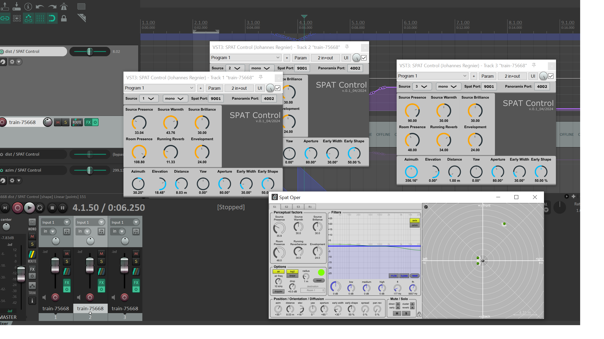

## SPAT Control Plugin

A small plugin to control the main source parameters for IRCAM Spat and/or Panoramix. 

Allows control via OSC of the following parameters:
- Source presence
- Source warmth
- Source brilliance
- Room presence
- Running reverberance
- Envelopment
- Spherical coordinates: azimuth, elevation, distance
- Yaw
- Aperture
- Early width
- Early shape

OSC packets are sent to 2 ports: one for Spat (connect a <udpreceive 9001> object to <spat5.oper>), one for Panoramix. 
For Panoramix, the following parameters are recognized: azimuth, elevation, distance, width (for stereo source), early width.

https://forum.ircam.fr/projects/detail/spat/ 
https://forum.ircam.fr/projects/detail/panoramix/

